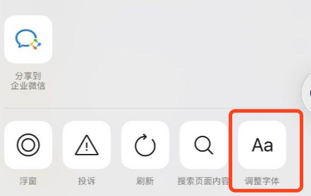

# Disable Adjust Font Size in WeChat

Disable adjust font size in wechat when browse webpage.

Use `WeixinJSBridge` listen `menu:setfont` event and set always to `{ fontSize: 0 }`.



# Installation

```bash
npm install disable-adjust-fontsize-in-wechat --save
```

# Usage

```js
import disableAdjustFontSize from 'disable-adjust-fontsize-in-wechat'

disableAdjustFontSize()
```

# License

MIT